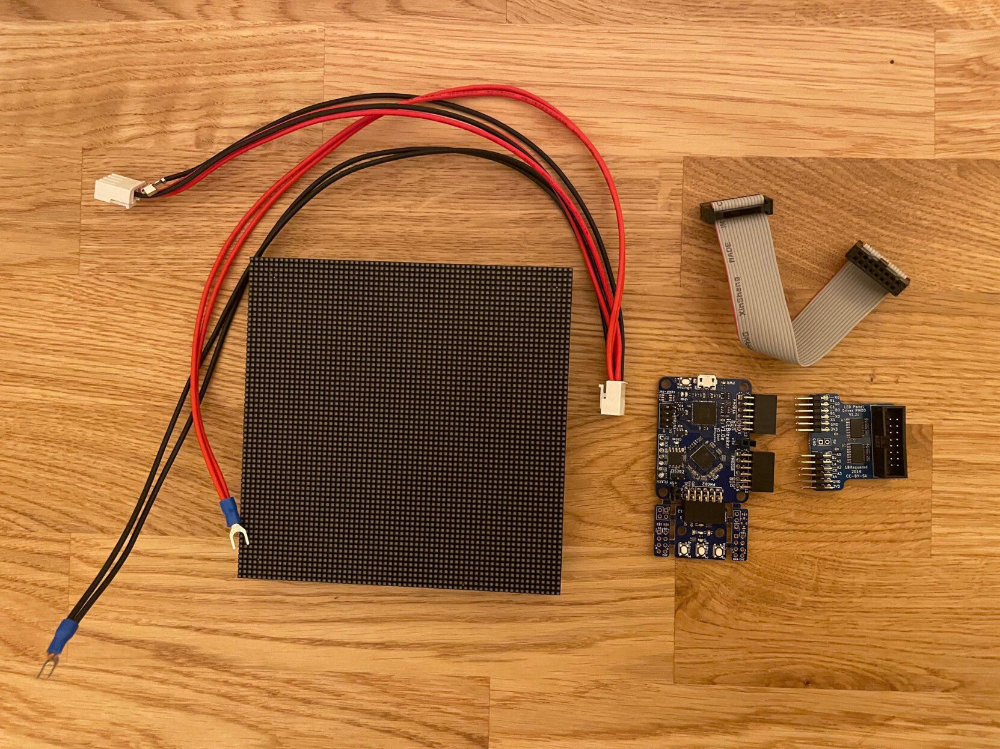
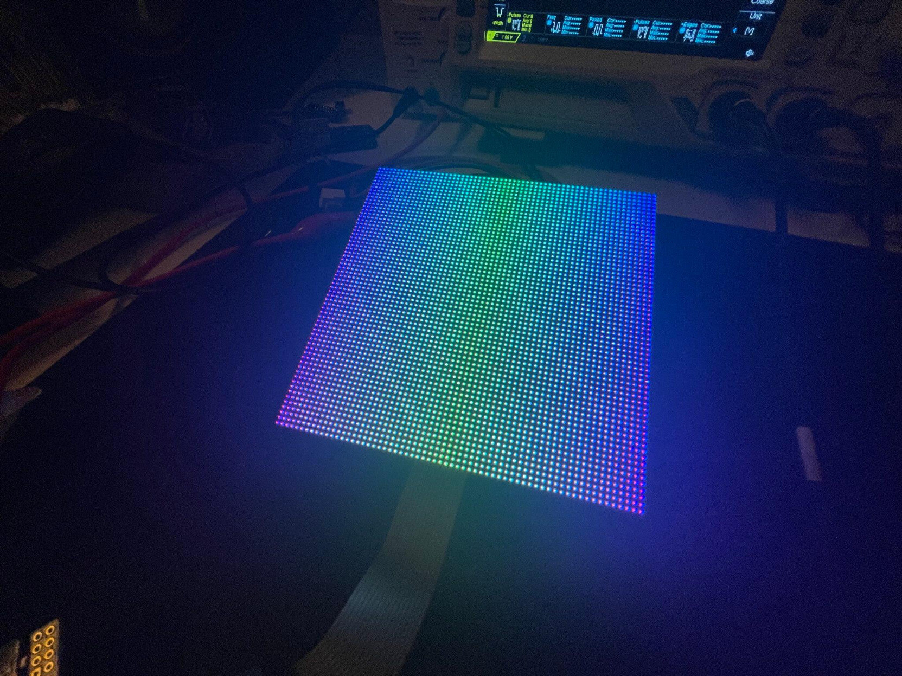

# FPGA stuff

I'm learning how to program FPGAs.

I have absolutely no idea what I'm doing.

## Projects in this repo

### HUB75E Display

I'm implementing the HUB75E protocol from scratch using Amaranth.

This project was semi-live tooted and explained in Fediverse:
[https://chaos.social/@vidister/109576161434662834](https://chaos.social/@vidister/109576161434662834)
